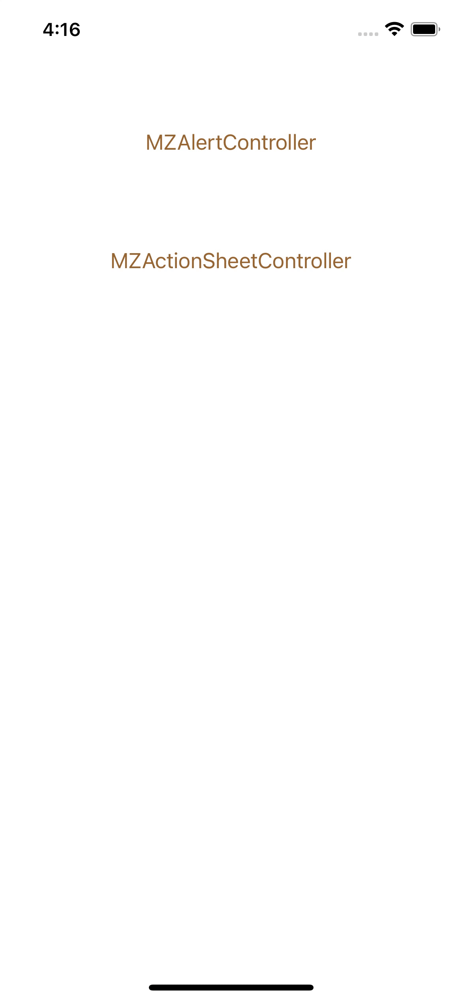

# MZAlertController
MZAlertController是Swift版本的自定义弹框基类，包含Alert、ActionSheet两个模式



#### Cocoapods 引入
```
pod 'MZAlertController', '~> 0.0.1'
```

#### MZAlertController
新建UIViewController继承自MZAlertController即可使用

##### 参数&方法说明

- dismissController

此方法为点击弹框底部遮罩的回调，如果需要点击底部遮罩取消弹框可如下调用dismiss方法，如果不需要的话，就不用实现该方法。

```
override func dismissController() {
    self.dismiss(animated: true, completion: nil)
}
```

#### MZActionSheetController
新建UIViewController继承自MZActionSheetController即可使用

##### 参数&方法说明

- Height

 此参数必须设置，Height表示ActionSheet弹出的高度，根据实际情况设置，注意兼容iPhoneX的底部安全高度,在
 
 ```
override func viewDidLoad() {
    super.viewDidLoad()
    self.Height = 200 + MZ_SAFE_BOTTOM
}
 ```
